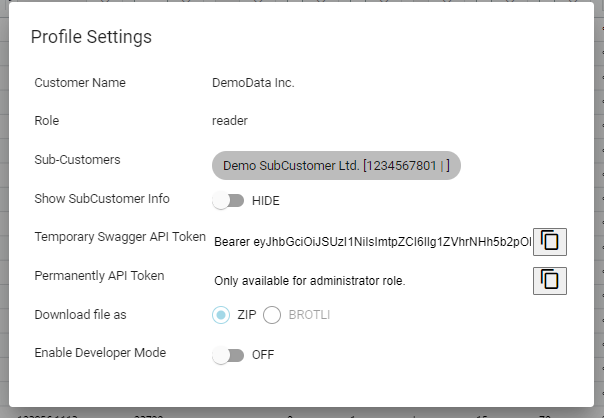
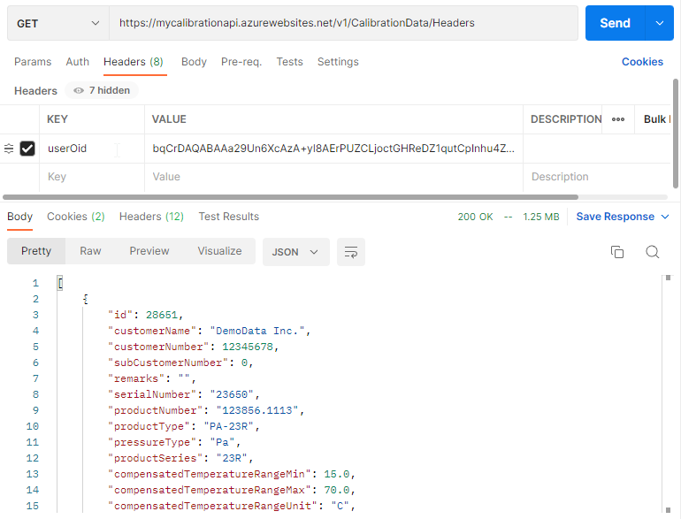

# 目次

1. [概要](#1-概要)
2. [Webアプリケーション](#2-webアプリケーション)
3. [Web API](#3-web-api)
4. [JSONスキーマ](#4-jsonスキーマ)
5. [サンプルソフトウェア](#5-サンプルソフトウェア)
6. [よくある質問（FAQ）](#6-よくある質問faq)
7. [ロードマップ](#7-ロードマップ)

---

## 1. 概要

KELLERの「myCalibration」は、KELLERの顧客向けのデータプラットフォームです。「myCalibration」を通じて、顧客はKELLERセンサーのデジタル校正データにアクセスできます。

### データ


#### 内容

「myCalibration」は、様々なKELLER製トランスデューサおよびトランスミッターのデータを取り扱うために設計されています。例えば、数学的補正モデルの情報やXライン送信機の校正データを保持できます。

#### 形式

校正データはJSONファイル形式で提供されます。この形式は広く普及しており、多くのプログラミングライブラリが利用可能なため、顧客のソフトウェアへの統合が簡単かつ迅速に行えます。また、JSONデータはテキストエディターで簡単に確認できます。

#### 構造

JSONファイルの構造はJSONスキーマで定義されており、このスキーマは公開されているため、顧客ソフトウェアへの完全な統合が可能です。

### アクセス方法

#### Webアプリケーション

標準のウェブブラウザからアクセス可能なユーザーインターフェースを通じて、顧客はセンサーの校正データにアクセスできます。顧客データは個別のログイン後にのみアクセス可能で、他のユーザーからは閲覧できません。

検索・フィルタリング機能を用いて、ユーザーは個別に選択したセンサーの校正データをダウンロードしたり、複数のデータセットを一括でダウンロードしたりできます。

#### Web API

REST APIが自動化されたアクセスのために提供されています。顧客はこのAPIをプロセスに統合することができます。例えば、新たに受け取ったセンサーの校正データを自動的にダウンロードし、生産プロセスに統合することができます。

---

## 2. Webアプリケーション

WebアプリケーションのURL：[https://mycalibration.azurewebsites.net/](https://mycalibration.azurewebsites.net)

無料のデモユーザーアカウントが利用可能です。

- ユーザー名: `Demo1234`
- パスワード: `Demo1234`

### サインアップとサインイン

ユーザーアカウントの登録は [engineering@keller-pressure.com](mailto:engineering@keller-pressure.com) にお問い合わせください。

デモデータを閲覧するための無料のデモアカウントが既に提供されています。

- ユーザー名: `Demo1234`
- パスワード: `Demo1234`


---

## 3. Web API

Web APIのURLは [https://mycalibrationapi.azurewebsites.net](https://mycalibrationapi.azurewebsites.net) です。

OpenAPI仕様ページは [https://mycalibrationapi.azurewebsites.net/swagger/index.html](https://mycalibrationapi.azurewebsites.net/swagger/index.html) です。

すべての校正データは以下の形式でエクスポートできます。

- JSONメタ情報（ヘッダーのみ）
- フィルタ済み・圧縮済みJSONファイル（ヘッダー＋データ）のZIPファイル

SwaggerのJSONファイルは [https://mycalibrationapi.azurewebsites.net/swagger/v1/swagger.json](https://mycalibrationapi.azurewebsites.net/swagger/v1/swagger.json) から取得できます。

### 主なAPIエンドポイント

#### GET /v1/CalibrationData/Headers

利用可能な校正データのメタ情報（ヘッダー部分）を返します。[ヘッダーデータ](#mefistoviewmodel)を参照。

| 名前   | パラメータ | 説明                                                             | 必須 | 型      |
| ------ | ---------- | ---------------------------------------------------------------- | ---- | ------- |
| skip   | query      | 任意。指定した行数分スキップします。Takeの逆です。                | いいえ | integer |
| take   | query      | 任意。最初の指定した数のメタ情報だけ取得します。Skipの逆です。指定しない場合、すべての行を取得します。 | いいえ | integer |

#### GET /v1/CalibrationData

校正データ全体をJSON形式で返します。[フィルターパラメータ](#filter-parameters)も利用できます。

#### GET /v1/CalibrationData/Export

フィルタ済みの校正データをZIP（またはBROTLI）ファイルとしてエクスポートします。ダウンロードリンクが返されます。*現在Brotliファイルタイプはサポートされていません。*

| 名前    | パラメータ | 説明                                                                                                                                       | 必須 | 型                       |
| ------- | ---------- | ------------------------------------------------------------------------------------------------------------------------------------------ | ---- | ------------------------ |
| fileType| query      | 1=すべての校正データを1つのJSONリストにまとめる 2=まとめたJSONをZIP圧縮 3=各校正データごとにJSONファイル化して1つのZIPに圧縮 4=同じくBrotli圧縮 | いいえ | [ExportFileType](#ExportFileType) |

※その他すべての[フィルターパラメータ](#filter-parameters)も使用可能

#### GET /v1/CalibrationData/Count

オプションの検索パラメータに基づき、校正データセットの件数を返します。[フィルター／検索パラメータ](#filter-parameters)を参照。
パラメータがnullの場合、アカウントがアクセスできるすべてのセンサー数を返します。
これにより、指定した条件で何件取得されるかをすぐ確認できます。

#### GET /v1/CalibrationData/List

オプションの検索パラメータで定義された校正データセットのすべての識別子文字列リストを取得します。[フィルター／検索パラメータ](#filter-parameters)参照。
これらの識別子（***IncludedIds***）は***GET /v1/CalibrationData***のクエリのフィルターパラメータとして利用可能です。

### GET /v1/CalibrationData/New

指定した日時（***since***）以降にmyCalibrationに保存されたすべてのデータを取得します。データは多くの場合、スイスからの出荷開始日の1日前に保存されます。これは出荷日と一致することもありますが、異なる場合もあります。

| 名前  | パラメータ | 説明                                      | 必須 | 型      |
| ----- | ---------- | ----------------------------------------- | ---- | ------- |
| since | query      | UTC日時。この時刻より新しいすべてのデータ | はい | integer |

### PUT /v1/CalibrationData/New

注意：本エンドポイントは十分な知識がある場合のみご利用ください。不明な場合は engineering@keller-pressure.com までご連絡ください。
すべての新規データを取得します。「新規データ」とは、このリクエストで一度も取得されていない校正データを指します。2回目のリクエストでは空になる場合があります。
新規データが保存できなかった場合は、`countOfHoursDataWasAlreadyRequested`で指定時間分過去のデータも再取得できます。
`countOfHoursDataWasAlreadyAssigned`も利用可能です。

| 名前                             | パラメータ | 説明                       | 必須 | 型      |
| -------------------------------- | ---------- | -------------------------- | ---- | ------- |
| take                             | query      |                            | いいえ | integer |
| countOfHoursDataWasAlreadyRequested | query      |                            | いいえ | integer |
| countOfHoursDataWasAlreadyAssigned | query      |                            | いいえ | integer |

### MefistoViewModel

Mefisto = MEtainfo for FIle STOrage
例：

```
{
  "id": 28651,
  "customerName": "DemoData Inc.",
  "customerNumber": 12345678,
  "subCustomerNumber": 0,
  "remarks": "",
  "serialNumber": "23650",
  "productNumber": "123856.1113",
  "productType": "PA-23R",
  "pressureType": "Pa",
  "productSeries": "23R",
  "compensatedTemperatureRangeMin": 15.0,
  "compensatedTemperatureRangeMax": 70.0,
  "compensatedTemperatureRangeUnit": "C",
  "compensatedPressureRangeMin": 0.0,
  "compensatedPressureRangeMax": 1.0,
  "compensatedPressureRangeUnit": "Bar",
  "electricSupplyMin": 4.5,
  "electricSupplyMax": 24.0,
  "electricSupplyMagnitude": 0.0,
  "electricSupplyUnit": "V",
  "orderNumber": 9990740,
  "orderPosition": 1,
  "orderTargetDispatchDate": "2017-05-26T00:00:00",
  "customerOrderNumber": "Cust-9990740-123",
  "customerReferenceNumber": "ABC",
  "customerProductType": "123451-1113",
  "subCustomerOrderNumber": null,
  "subCustomerOrderPosition": null,
  "assignedToSubCustomerDateUtc": null
}
```

| 項目名                           | 型         | 説明                                                                                          |
|----------------------------------|------------|---------------------------------------------------------------------------------------------|
| Id                               | Integer    | 内部ID                                                                                       |
| CustomerName                     | String     | 顧客名                                                                                       |
| CustomerNumber                   | Integer    | KELLER顧客識別番号                                                                           |
| SubCustomerNumber                | Integer    | 顧客の顧客用KELLER顧客識別番号                                                               |
| Remarks                          | String     | ファイル作成日（UTC）                                                                        |
| SerialNumber                     | String     | KELLER製品シリアル番号                                                                       |
| ProductNumber                    | String     | KELLER製品番号                                                                               |
| ProductType                      | String     | KELLER製品タイプ                                                                             |
| PressureType                     | String     | KELLER製品圧力タイプ                                                                         |
| ProductSeries                    | String     | KELLER製品シリーズ                                                                           |
| CompensatedTemperatureRangeMin   | Double     | センサー特性が補償されている温度範囲の最小値                                                 |
| CompensatedTemperatureRangeMax   | Double     | センサー特性が補償されている温度範囲の最大値                                                 |
| CompensatedTemperatureRangeUnit  | String     | センサー特性が補償されている温度範囲の単位                                                   |
| CompensatedPressureRangeMin      | Double     | センサー特性が補償されている圧力範囲の最小値                                                 |
| CompensatedPressureRangeMax      | Double     | センサー特性が補償されている圧力範囲の最大値                                                 |
| CompensatedPressureRangeUnit     | String     | センサー特性が補償されている圧力範囲の単位                                                   |
| ElectricSupplyMin                | Double     | 公称電源電圧の最小値                                                                         |
| ElectricSupplyMax                | Double     | 公称電源電圧の最大値                                                                         |
| ElectricSupplyMagnitude          | Double     | 公称電源の大きさ                                                                             |
| ElectricSupplyUnit               | String     | 公称電源の単位                                                                               |
| OrderNumber                      | Integer    | KELLERの注文番号                                                                             |
| OrderPosition                    | Integer    | KELLERの注文ポジション                                                                       |
| OrderTargetDispatchDate          | Date       | 注文の予定出荷日                                                                             |
| CustomerOrderNumber              | String     | 顧客の内部注文番号                                                                           |
| CustomerReferenceNumber          | String     | 顧客の内部参照番号                                                                           |
| CustomerProductType              | String     | 顧客の内部製品タイプ                                                                         |
| SubCustomerOrderNumber           | String     | サブ顧客のための顧客発行の請求書番号                                                         |
| SubCustomerOrderPosition         | String     | サブ顧客に関する追加注文詳細（例：「請求書行」など）                                         |
| AssignedToSubCustomerDateUtc     | Date       | データがサブ顧客に割り当てられたタイムスタンプ                                               | 

### フィルターパラメータ

| 項目名                 | 指定場所 | 説明                                                                                                                                                                                                                                                                                                                                                                                               | 必須 | スキーマ        |
|------------------------|----------|----------------------------------------------------------------------------------------------------------------------------------------------------------------------------------------------------------------------------------------------------------------------------------------------------------------------------------------------------------------------------------------------------|------|----------------|
| IncludedIds            | query    | nullの場合：「すべて選択」または一部が除外（ExcludedIdsに記載）／nullでない場合：ここに記載されたもののみ選択される。他は選択不可。IncludedIdsとExcludedIdsの両方に値を持つことはできません。どちらか一方または両方ともnullでなければなりません。リストは最大50件まで。超えるとエラー。                                   | いいえ | [ string ]     |
| ExcludedIds            | query    | nullの場合：「すべて選択」または一部のみが選択（IncludedIdsに記載）／nullでない場合：ここに記載されたもの以外はすべて選択される。IncludedIdsとExcludedIdsの両方に値を持つことはできません。どちらか一方または両方ともnullでなければなりません。リストは最大50件まで。超えるとエラー。                      | いいえ | [ string ]     |
| OrderNumbers           | query    | 注文番号のリスト                                                                                                                                                                                                                                                                                                                                                                                   | いいえ | [ string ]     |
| OrderPositions         | query    | 注文ポジションのリスト                                                                                                                                                                                                                                                                                                                                                                             | いいえ | [ string ]     |
| DateFilterType         | query    | 'equals', 'greaterThan', 'lessThan', 'notEqual', 'inRange' のいずれか。'inRange'のときはDateToが必要。<br />例1:「2021-08-01以降のすべてのデータ」=<https://mycalibrationapi.azurewebsites.net/v1/CalibrationData?DateFilterType=greaterThan&Date=2021-08-01><br />例2:「2020年のすべてのデータ」=<https://mycalibrationapi.azurewebsites.net/v1/CalibrationData?DateFilterType=inRange&Date=2021-01-01&DateTo=2021-12-31><br />例3:「1月1日と2月1日のすべてのデータ」=<https://mycalibrationapi.azurewebsites.net/v1/CalibrationData?DateFilterType=equals&Date=2021-01-01&Date=2021-02-01> | いいえ | string         |
| Date                  | query    | 出荷日（yyyy-MM-dd 形式、例: \"2021-12-24\"）。通常は1つのみだが、複数日取得も可能。この場合DateFilterTypeは'equals'かつDateToはnull。                                                                                                                        | いいえ | [ string ]     |
| DateTo                | query    | DateFilterType='inRange'時に使用。'Date'から'DateTo'までのデータを取得。日付形式は'yyyy-MM-dd'（例: \"2021-12-24\"）                                                                                                                                                                                                  | いいえ | string         |
| CustomerProductTypes   | query    | [Blanks]を検索するには「blank」を使用                                                                                                                                                                                                                                                                                                                        | いいえ | [ string ]     |
| PressureTypes          | query    | 例: [\"pa\",\"paa\",\"pr\"]  すべての列挙型は<https://mycalibration.github.io/#filter-parameters>参照                                                                                                                                                                                                                 | いいえ | [ string ]     |
| ProductSeries          | query    | 例: [\"10LHP\",\"25Y\",\"46X\",\"K-102\"]                                                                                                                                                                                                                                                                                                                  | いいえ | [ string ]     |
| ProductNumbers         | query    |                                                                                                                                                                                                                                                                                                                                                            | いいえ | [ string ]     |
| SerialNumberSearchText | query    | このテキストを含むシリアル番号すべてを検索                                                                                                                                                                                                                                                                                                                  | いいえ | string         |
| PressureMinFilterType  | query    | 'equals', 'greaterThan', 'lessThan', 'notEqual', 'inRange', 'lessThanOrEqual', 'greaterThanOrEqual'のいずれか。'inRange'の場合はPressureMinToが必要                                                                                                                            | いいえ | string         |
| PressureMin            | query    | 「最小圧力」の下限値（排他的）                                                                                                                                                                                                                                                                                                                             | いいえ | double         |
| PressureMinTo          | query    | 「最小圧力」の上限値（排他的）。PressureMinFilterTypeが'inRange'のとき使用。'PressureMin'から'PressureMinTo'の間のデータを取得。日付形式は'yyyy-MM-dd'（例: \"2021-12-24\"）                                                                                                  | いいえ | double         |
| PressureMaxFilterType  | query    | 'equals', 'greaterThan', 'lessThan', 'notEqual', 'inRange', 'lessThanOrEqual', 'greaterThanOrEqual'のいずれか。'inRange'の場合はPressureMaxToが必要                                                                                                                            | いいえ | string         |
| PressureMax            | query    | 「最大圧力」の下限値（排他的）                                                                                                                                                                                                                                                                                                                             | いいえ | double         |
| PressureMaxTo          | query    | 「最大圧力」の上限値（排他的）。PressureMaxFilterTypeが'inRange'のとき使用。'PressureMax'から'PressureMaxTo'の間のデータを取得。日付形式は'yyyy-MM-dd'（例: \"2021-12-24\"）                                                                                                  | いいえ | double         |
| PressureUnit           | query    | 圧力単位のリスト                                                                                                                                                                                                                                                                                                                                           | いいえ | [ string ]     |
| TemperatureMinFilterType | query  | 'equals', 'greaterThan', 'lessThan', 'notEqual', 'inRange', 'lessThanOrEqual', 'greaterThanOrEqual'のいずれか。'inRange'の場合はTemperatureMinToが必要                                                                                                                         | いいえ | string         |
| TemperatureMin         | query    | 「最小温度」の下限値（排他的）                                                                                                                                                                                                                                                                                                                            | いいえ | double         |
| TemperatureMinTo       | query    | 「最小温度」の上限値（排他的）。TemperatureMinFilterTypeが'inRange'のとき使用。'TemperatureMin'から'TemperatureMinTo'の間のデータを取得。日付形式は'yyyy-MM-dd'（例: \"2021-12-24\"）                                                                                          | いいえ | double         |
| TemperatureMaxFilterType | query  | 'equals', 'greaterThan', 'lessThan', 'notEqual', 'inRange', 'lessThanOrEqual', 'greaterThanOrEqual'のいずれか。'inRange'の場合はTemperatureMaxToが必要                                                                                                                         | いいえ | string         |
| TemperatureMax         | query    | 「最大温度」の下限値（排他的）                                                                                                                                                                                                                                                                                                                            | いいえ | double         |
| TemperatureMaxTo       | query    | 「最大温度」の上限値（排他的）。TemperatureMaxFilterTypeが'inRange'のとき使用。'TemperatureMax'から'TemperatureMaxTo'の間のデータを取得。日付形式は'yyyy-MM-dd'（例: \"2021-12-24\"）                                                                                          | いいえ | double         |
| TemperatureUnit        | query    | 温度単位のリスト                                                                                                                                                                                                                                                                                                                                          | いいえ | [ string ]     |
| SupplyMinFilterType    | query    | 'equals', 'greaterThan', 'lessThan', 'notEqual', 'inRange', 'lessThanOrEqual', 'greaterThanOrEqual'のいずれか。'inRange'の場合はSupplyMinToが必要。Min/MaxまたはMagnitudeどちらかが使用される                                          | いいえ | string         |
| SupplyMin              | query    | 「最小電源」の下限値（排他的）。Min/MaxまたはMagnitudeどちらかが使用される                                                                                                                                                                                                                                           | いいえ | double         |
| SupplyMinTo            | query    | 「最小電源」の上限値（排他的）。SupplyMinFilterTypeが'inRange'のとき使用。'SupplyMin'から'SupplyMinTo'の間のデータを取得。日付形式は'yyyy-MM-dd'（例: \"2021-12-24\"）。Min/MaxまたはMagnitudeどちらかが使用される                                         | いいえ | double         |
| SupplyMaxFilterType    | query    | 'equals', 'greaterThan', 'lessThan', 'notEqual', 'inRange', 'lessThanOrEqual', 'greaterThanOrEqual'のいずれか。'inRange'の場合はSupplyMaxToが必要。Min/MaxまたはMagnitudeどちらかが使用される                                          | いいえ | string         |
| SupplyMax              | query    | 「最大電源」の下限値（排他的）。Min/MaxまたはMagnitudeどちらかが使用される                                                                                                                                                                                                                                           | いいえ | double         |
| SupplyMaxTo            | query    | 「最大電源」の上限値（排他的）。SupplyMaxFilterTypeが'inRange'のとき使用。'SupplyMax'から'SupplyMaxTo'の間のデータを取得。日付形式は'yyyy-MM-dd'（例: \"2021-12-24\"）。Min/MaxまたはMagnitudeどちらかが使用される                                         | いいえ | double         |
| SupplyMagnitudeFilterType | query | 'equals', 'greaterThan', 'lessThan', 'notEqual', 'inRange', 'lessThanOrEqual', 'greaterThanOrEqual'のいずれか。'inRange'の場合はSupplyMagnitudeToが必要。Min/MaxまたはMagnitudeどちらかが使用される                                 | いいえ | string         |
| SupplyMagnitude        | query    | 「電源大きさ」の下限値（排他的）。Min/MaxまたはMagnitudeどちらかが使用される                                                                                                                                                                                                                                         | いいえ | double         |
| SupplyMagnitudeTo      | query    | 「電源大きさ」の上限値（排他的）。SupplyMagnitudeFilterTypeが'inRange'のとき使用。'SupplyMagnitude'から'SupplyMagnitudeTo'の間のデータを取得。Min/MaxまたはMagnitudeどちらかが使用される                                                   | いいえ | double         |
| SupplyUnit             | query    | 電源単位のリスト                                                                                                                                                                                                                                                                                                                                         | いいえ | [ string ]     |
| CustomerReferenceNumberSearchText | query | この検索テキストを含むすべてのデータを取得                                                                                                   | いいえ | string         |
| CustomerOrderNumberSearchText     | query | この検索テキストを含むすべてのデータを取得                                                                                                   | いいえ | string         |
| RemarksSearchText                 | query | この検索テキストを含むすべてのデータを取得                                                                                                   | いいえ | string         |

#### フィルターパラメータ - 物理単位 & 圧力タイプ

#### フィルターパラメータ - 物理単位 : PressureUnit, TemperatureUnit, SupplyUnit

UIやJSON上で「*%FS*」と表示されている場合でも、APIパラメータでは「*Fs*」を使います。

```
 ________________________
|          |             |
|  単位     | API文字列   |
|__________|_____________|
|  %FS     |  Fs         |
|  A       |  A          |
|  K       |  K          |
|  MOhm    |  MOhm       |
|  MPa     |  MPa        |
|  Ohm     |  Ohm        |
|  Pa      |  Pa         |
|  Torr    |  Torr       |
|  V       |  V          |
|  VDC     |  VDC        |
|  atm     |  Atm        |
|  bar     |  Bar        |
|  cmH2O   |  CmH2O      |
|  cmHg    |  CmHg       |
|  ftH2O   |  FtH2O      |
|  hPa     |  HPa        |
|  inH2O   |  InH2O      |
|  inHg    |  InHg       |
|  kN/m2   |  KNM2       |
|  kOhm    |  KOhm       |
|  kPa     |  KPa        |
|  kp/cm2  |  KpCm2      |
|  lbf/ft2 |  LbfFt2     |
|  mA      |  MA         |
|  mH2O    |  MH2O       |
|  mV      |  MV         |
|  mV/V    |  MVV        |
|  mV/mA   |  MVMA       |
|  mbar    |  Mbar       |
|  mmH2O   |  MmH2O      |
|  mmHg    |  MmHg       |
|  psi     |  Psi        |
|  °C      |  C          |
|________________________|
```


##### フィルターパラメータ - 圧力タイプ

UIやJSON上で「*PA*」と表示されている場合でも、APIパラメータでは「*Pa*」を使います。


```
 ______________________
|        |             |
|  単位  |  API文字列  |
|________|_____________|
|  PA    |  Pa         |
|  PAA   |  Paa        |
|  PD    |  Pd         |
|  PR    |  Pr         |
|  PRD   |  Prd        |
|______________________|
```


### クエリ例

詳細は <https://github.com/mycalibration/mycalibration.github.io> をご参照ください。

### OpenAPI/Swaggerスキーマからクライアントソフトウェアを生成する

[https://editor.swagger.io/](https://editor.swagger.io/) を使用してください。  
Swagger/OpenAPIのインポートURLはこちら：<https://mycalibrationapi.azurewebsites.net/swagger/v1/swagger.json>

### Permanent Access Token（永続アクセストークン）によるAPIアクセス

トークンには2種類あります。Permanent Access Token（永続アクセストークン）とTemporary Access Token（一時アクセストークン）です。

Temporary Access Tokenを使うと、[Swagger/OpenAPI UI](https://mycalibrationapi.azurewebsites.net/swagger/index.html)経由でログイン後、数時間APIでデータ取得が可能です。

Permanent Access Tokenは、手動ログイン不要でプログラムからAPIにアクセスする際に使用します。

#### 一時アクセストークン（Temporary Access Token）

一時アクセストークンは、プロフィール設定画面から取得できます：  


[Swagger/OpenAPI UI](https://mycalibrationapi.azurewebsites.net/swagger/index.html)の「Authorize」ボタンをクリックし、一時アクセストークンを入力します。  


#### 永続アクセストークン（Permanent Access Token）

現在、永続アクセストークンはKELLERのmyCalibrationサポートチーム <engineering@keller-pressure.com> から直接申請が必要です。

提供されたアクセストークンは、すべてのリクエストのヘッダーに 'userOid' キーとして追加してください。これによりBearerトークンやOAuth 2フローは不要になります。


APIテストには、Postman、Insomnia、curlなどのツールが利用できます。  
多くのプログラミング例が [Github](https://github.com/mycalibration/mycalibration.github.io/) に掲載されています。
C#によるサンプル：

 ```csharp
 var url         = "https://mycalibrationapi.azurewebsites.net/v1/CalibrationData/Headers";
 var httpRequest = (HttpWebRequest)WebRequest.Create(url);
 
 // userOidキーで永続アクセストークンをヘッダーに追加
 httpRequest.Headers["userOid"] = "eyJhbGciOiJIUzI1NiIsInR....";
 
 string resultJsonText;
 HttpWebResponse httpResponse = (HttpWebResponse)httpRequest.GetResponse();
 using (var streamReader = new StreamReader(httpResponse.GetResponseStream()))
 {
   resultJsonText = streamReader.ReadToEnd();
 }
 ```

---

## 4. JSONスキーマ

スキーマは [こちら](https://github.com/mycalibration/mycalibration.github.io/blob/main/schema/keller-sensor-data.schema.json) からJSON Schemaとしてダウンロードできます。また、[こちら](https://editor.swagger.io/) で様々なファイル形式に変換できます。

| ルートオブジェクト         | 説明                                                                             |
|--------------------------|----------------------------------------------------------------------------------|
| Version                  | スキーマのバージョン文字列（セマンティックバージョニング、例："1.0.0"）         |
| Header                   | センサーデータを特定するためのメタ情報                                           |
| CompensationMethods      | MathModデータ                                                                    |
| Measurements             | T/P校正カーブの測定点                                                            |


| ルートオブジェクト | オブジェクト         | スキーマ説明                                                       | 詳細                                      | 型      | 例                                       |
|------------------|---------------------|--------------------------------------------------------------------|-------------------------------------------|---------|------------------------------------------|
| version *        |                     | 対応するJSONスキーマのバージョン                                   | セマンティックバージョニング形式のバージョン | string  | "1.0.0"                                 |
| header *         |                     | ヘッダー情報                                                       | 測定データ（measurements）を特定・管理するためのメタ情報 |         |                                          |
|                  | creationDate        | ファイル作成日                                                     |                                           | string  | "2022-03-22"                             |
|                  | orderTargetDispatchDate * | 注文の予定出荷日                                                |                                           | string  | "2022-03-15"                             |
|                  | orderNumber *       | KELLERの注文番号                                                   |                                           | int     | 9990016                                  |
|                  | orderPosition *     | KELLERの注文ポジション                                             |                                           | int     | 3                                        |
|                  | customerProductType * | 顧客内製品タイプ                                                 |                                           | string  | "9990016-123"                            |
|                  | pressureType *      | 圧力タイプ                                                         |                                           | string  | "PAA"                                    |
|                  | productSeries *     | KELLER製品シリーズ                                                 |                                           | string  | "33X"                                    |
|                  | productType *       | KELLER製品タイプ                                                   |                                           | string  | "PAA-33X"                                |
|                  | productNumber *     | KELLER製品番号                                                     |                                           | string  | "1234567.0001"                           |
|                  | serialNumber *      | KELLERシリアル番号                                                 |                                           | string  | "I123456"                                |
|                  | compensatedPressureRange * | センサー特性が補償されている圧力範囲                          |                                           | object  | {"max": 1.0, "min": 0.0, "unit": "bar"}  |
|                  | compensatedTemperatureRange * | センサー特性が補償されている温度範囲                          |                                           | object  | {"max": 70.0, "min": 15.0, "unit": "°C"} |
|                  | electricSupply *    | 公称電源                                                           |                                           | object  | {"unit":"V","max":24.0,"min":4.5}         |
|                  | customerReferenceNumber * | 顧客の内部参照番号                                             |                                           | string  | "Jane Doe"                               |
|                  | remarks *           | 備考                                                               |                                           | string  | ""                                       |
|                  | customerName *      | 顧客名                                                             |                                           | string  | "DemoData Inc."                          |
|                  | customerNumber *    | KELLER顧客識別番号                                                 |                                           | string  | "9990016 Rev. 2"                         |
|                  | customerOrderNumber * | 顧客内部注文番号                                                 |                                           |         | "123456700012"                           |
| measurements[] * |                     | 各測定値の配列。順序は測定シーケンスに対応                         |                                           | Array of Measurement |                  |
|                  | reference *         | KELLERによる測定データへの参照                                      |                                           | string  | "TSX_ABCD567P89"                         |
|                  | environment *       | 測定点の実環境                                                    |                                           | object  | {"pressure": {...}, "temperature": {...}} |
|                  | environmentTarget   | 測定点の目標環境                                                  |                                           | object  | {"pressure": {...}, "temperature": {...}} |
|                  | raw                 | 生測定値                                                          |                                           | object  | {"bridgeResistance": {...}, "signal": {...}} |
|                  | compensated         | 補償値（さまざまな補償手法による）                                 |                                           | object  | {"compensationCircuitOutputs": {...}}     |
| compensationMethods |                   | 各種補償手法の情報                                                |                                           |         |                                          |
|                  | mathematicalModel   | 数理補償モデル                                                    |                                           | object  | {...}                                    |
|                  | compensationCircuit | 補償回路                                                          |                                           | object  | {...}                                    |

---

## 5. サンプルソフトウェア

Githubリポジトリ: [https://github.com/mycalibration/mycalibration.github.io/](https://github.com/mycalibration/mycalibration.github.io/)

- **/docs**  *- ドキュメントページ <https://mycalibration.github.io/> の内容*
- **/samples**
  - **/api**
    - [**/csharp-dotnet/simple**](https://github.com/mycalibration/mycalibration.github.io/tree/main/samples/api/csharp-dotnet/simple) *- C#でAPIからデータを取得しパースするシンプルな例*
    - [**/csharp-dotnet/swagger-codegen**](https://github.com/mycalibration/mycalibration.github.io/tree/main/samples/api/csharp-dotnet/swagger-codegen)  *- OpenAPIファイルから自動生成されたコード。/editor.swagger.ioで生成*
    - [**/python/simple**](https://github.com/mycalibration/mycalibration.github.io/blob/main/samples/api/python/simple/get-data.py)  *- PythonでAPIからデータを取得しパースするシンプルな例*
    - [**/python/swagger-codegen**](https://github.com/mycalibration/mycalibration.github.io/tree/main/samples/api/python/swagger-codegen)    *- OpenAPIファイルから自動生成されたPythonコード例*
    - [**/labview/simple**](https://github.com/mycalibration/mycalibration.github.io/blob/main/samples/api/labview/simple/)  *- LabViewによるAPIアクセス例（永続アクセストークンの利用例を含む）*
  - [**/data-model/KellerSensorData.cs**](https://github.com/mycalibration/mycalibration.github.io/blob/main/samples/data-model/KellerSensorData.cs)  *- データスキーマを実装したC#クラス*  
  - **/json-to-csv**
    - [**/json-to-csv-converter**](https://github.com/mycalibration/mycalibration.github.io/tree/main/samples/json-to-csv/json-to-csv-converter/)  *- JSONデータを旧CSVテキストデータへ変換するサンプルコード*
    - [**/ConverterUsageSample/Program.cs**](https://github.com/mycalibration/mycalibration.github.io/blob/main/samples/json-to-csv/ConverterUsageSample/Program.cs)  *- コンバータの使用例*
    - [**/OnlineConverterBlazorApp**](https://github.com/mycalibration/mycalibration.github.io/blob/main/samples/json-to-csv/OnlineConverterBlazorApp/)  *- Blazor Web Assemblyアプリによる変換例*
  - [**/combined/WinFormsApp**](https://github.com/mycalibration/mycalibration.github.io/tree/main/samples/combined/WinFormsApp) *- Windows Forms デモアプリ（C#/.NET6） APIで取得したデータをC#オブジェクトへ変換し、旧CSV形式へ変換*
- [**/schema/keller-sensor-data.schema.json**](https://github.com/mycalibration/mycalibration.github.io/blob/main/schema/keller-sensor-data.schema.json)  *- myCalibration用JSONスキーマ*  

- オンライン「JSON → 旧テキストファイル」変換ツール: [https://mycalibration.github.io/converter](https://mycalibration.github.io/converter)

---

## 6. よくある質問（FAQ）

- ***「myCalibration」サービスを試すことはできますか？***  
  はい。ユーザー名「Demo1234」とパスワード「Demo1234」を使用してください。デモデータが含まれるデモアカウントにアクセスできます。

- ***データを自動的にダウンロードし、自分のデータベースやSCADA、ファイルシステムに保存するには？***  
  Web API（[https://mycalibrationapi.azurewebsites.net/](https://mycalibrationapi.azurewebsites.net/)）と永続アクセストークンを使用して、REST API経由で必要な時にデータにアクセスできます。ソフトウェアの作成も複雑ではありません。適切なフィルターパラメータを利用し、定期的にデータを取得してください。

- ***データダウンロード用のソフトウェア開発で一番簡単な方法は？***  
  [https://github.com/mycalibration/mycalibration.github.io/](https://github.com/mycalibration/mycalibration.github.io/) にオープンソースのサンプルソフトウェアがあります。  
  [swagger UI](https://mycalibrationapi.azurewebsites.net/swagger/index.html)と一時アクセストークンを使って、フィルターパラメータの動作を体験できます。  
  [swaggerファイル](https://mycalibrationapi.azurewebsites.net/swagger/v1/swagger.json)を使い、[https://editor.swagger.io/](https://editor.swagger.io/) などのジェネレータSWでお好きな言語（C#, Go, HTML, Java, Javascript, Python, PHP, Scala, Typescript等）のクライアントSWを自動生成できます。

- ***JSONファイルを解析して必要な情報を取り出すには？***  
  JSONファイルは [JSONスキーマ](https://github.com/mycalibration/mycalibration.github.io/blob/main/schema/keller-sensor-data.schema.json) に準拠しています。このスキーマを利用して解析コードを自動生成できます。詳細は[こちら](https://json-schema.org/implementations.html#generators-from-schemas)  
  [https://app.quicktype.io/](https://app.quicktype.io/) を使って [C#データクラス](https://github.com/mycalibration/mycalibration.github.io/blob/main/samples/data-model/KellerSensorData.cs) を生成し、簡単にJSONをデシリアライズできます。  
  例として、[コンバータ例](https://github.com/mycalibration/mycalibration.github.io/tree/main/samples/json-to-csv/json-to-csv-converter/myCalibration.Converters) では、JSONデータを解析し、古いtxt/CSV形式に変換しています。

- ***新しいデータはどうやって探すの？通知機能はある？***  
  いいえ、通知システムはありません。新しいデータがあるかどうかAPIに定期的に問い合わせる必要があります。  
  以下の方法が考えられます：  
    - 校正データの件数を定期的にチェック。増えていれば新データを探す（```GET https://mycalibrationapi.azurewebsites.net/v1/CalibrationData/Count``` を利用）。
    - 全メタデータ（```GET https://mycalibrationapi.azurewebsites.net/v1/Headers```）を取得し、保存済みデータと比較（*ProductNumber*や*SerialNumber*を利用）。
    - Dispatch-Date（出荷予定日）は新規データの判別に適しません。実際には出荷日と一致しない場合があります。
    - ```PUT https://mycalibrationapi.azurewebsites.net/v1/CalibrationData/New``` エンドポイントを使うと、すべての新規データを取得できます（リクエスト後、そのデータは「取得済み」としてマークされるので、再度取得すると空になる場合あり）。
    - 識別子（identifier strings）を保存し、リスト取得して新規を比較検索。新規分だけ個別に ```GET https://mycalibrationapi.azurewebsites.net/v1/CalibrationData?IncludedIds=12345&IncludedIds=12346``` などで取得。
    - ```GET https://mycalibrationapi.azurewebsites.net/v1/CalibrationData/New``` で、指定日時以降に新たに取り込まれたデータ一覧を取得。
    - 上記の組み合わせとして ```GET https://mycalibrationapi.azurewebsites.net/v1/CalibrationData/List/New?since=2023-04-01T12:15:00.000Z``` で、指定日時以降の新しい識別子リスト取得→自分の保存データと突合。

- ***API利用のベストプラクティスや推奨エンドポイントは？***  
  基本的には下記2段階を推奨します：  
    1. 定期的に新規データを取得しDBやファイルシステムに保存  
    2. JSONから係数など必要情報を抽出し保存、もしくはセンサーファームウェア等で利用  
  - データ件数確認は ```GET https://mycalibrationapi.azurewebsites.net/v1/CalibrationData/Count``` で実施し、差分のみ取得。
  - または ```GET https://mycalibrationapi.azurewebsites.net/v1/CalibrationData/Header``` で全メタ情報を取得。これはWebアプリで表示されるカラム情報です。
  - フィルター指定で必要な情報だけ取得するのが最も効率的です。Webアプリで「Developer Mode」を有効にすると使用フィルターパラメータとAPIリクエストを確認できます。
  - データ本体の取得は ```GET https://mycalibrationapi.azurewebsites.net/v1/CalibrationData``` が推奨。フィルタ済みJSONファイル一覧が返されます。
  - シリアル番号のリストがある場合はそれをフィルターに使って個別に取得も可。
  - ```GET https://mycalibrationapi.azurewebsites.net/v1/CalibrationData/Export``` は推奨しません。基本は直接JSON取得で十分です。
  - myCalibration APIは常時100%稼働保証ではありません。エラー時のリトライなど適切な実装をしてください。

- ***ファイルはどのように一意に識別されますか？シリアル番号だけで十分ですか？***  
  一般的には product-number と serial-number の組み合わせでユニークです。
  ただし、実際のJSONファイル名は  
  ```{Product Number}_{Serial Number}_{File Creation Date}_{MathMod Number}.json```  
  例: **100715.0244_X12345_2023-04-06_0123.json**  
  稀に再校正等で同じセンサーが再登録される場合があるため、ファイル作成日が含まれています。また、MathMod番号も利用シーンにより複数含まれることがあります。

- ***同じシリアル番号で複数のエントリーがある場合は？***  
  修理や再校正で同一シリアルが複数登録されることがあります。その場合、一意ではなくなります。WebアプリやAPIで複数ヒットしますが、最新のもの（File Creation Dateカラムが最も新しいもの）が正しいエントリーとなります。

- ***APIから「新規」データだけ取得するには？***  
  ```GET https://mycalibrationapi.azurewebsites.net/v1/CalibrationData``` ですべてを取得する代わりに、```PUT https://mycalibrationapi.azurewebsites.net/v1/CalibrationData/New``` を使うと「未取得の新しいデータ」のみが取得できます。このリクエストでデータは「取得済み」とマークされるため、以降のPUTリクエストで同じデータは返されません（ただし、オプションで ```countOfHoursDataWasAlreadyRequested``` や ```countOfHoursDataWasAlreadyAssigned``` を指定すれば、指定時間分さかのぼって再取得も可能）。

- ***利用規約はどこで見られますか？***  
  [myCalibration 利用規約](https://download.keller-pressure.com/api/download/uQYYFTYxSVACfwAHfR7CQ3/en/2025-04.pdf)

- ***コンバータを試したが、慣れ親しんだTXTファイルと完全一致しません。なぜ？***  
  このコンバータはJSONにほぼすべての情報が含まれていることを示すための参考実装であり、完全な1:1変換や商用利用を想定していません。

- ***長年TestRun.txtやCSVファイルを使ってきました。なぜJSONに移行する必要が？***  
  開発者にとってJSONへの移行はサンプル多数で容易です。[コンバータ例](https://github.com/mycalibration/mycalibration.github.io/tree/main/samples/json-to-csv/json-to-csv-converter/myCalibration.Converters)では必要なデータ取得方法が示されています。  
  [オンラインコンバータ](https://mycalibration.github.io/converter)でもJSONデータから必要情報を抽出できます。

- ***このプラットフォームは安全ですか？何か標準に準拠していますか？***  
  はい。顧客データは個別ログイン後のみアクセスでき、他人には見えません。マイクロソフトの「Azure Active Directory B2C」認証技術や監査、ベストプラクティスにより高いセキュリティを確保しています。  
  「myCalibration」プラットフォームはMicrosoft（Azure）データセンター（EU内、EU規制に準拠）で運用されています。個人情報は保存していません。  
  Microsoftの標準は [こちら（概要）](https://azure.microsoft.com/en-us/overview/trusted-cloud/) や [ISO認証一覧](https://www.microsoft.com/en-us/trustcenter/compliance/complianceofferings) をご参照ください。

- ***APIの永続アクセストークンはどこで取得できますか？***  
  一時・永続アクセストークンはWebアプリの「プロフィール設定」画面（会社名ボタン）から確認できます。  
  一時アクセストークンは [Swagger/OpenAPI UI](https://mycalibrationapi.azurewebsites.net/swagger/index.html) で利用可能です。  
  永続アクセストークンが表示されない場合は engineering@keller-pressure.com までご連絡ください。

- ***永続アクセストークンでAPIを利用する方法は？***  
  [Permanent Access TokenでAPIにアクセスする方法](#permanent-access-tokenによるapiアクセス) をご参照ください。

---

## 7. ロードマップ

- ドキュメント／スキーマの更新  
- リリースノートや計画メンテナンス情報の更新  
- 新しい「Pressure Line Dependency」説明追加  

---