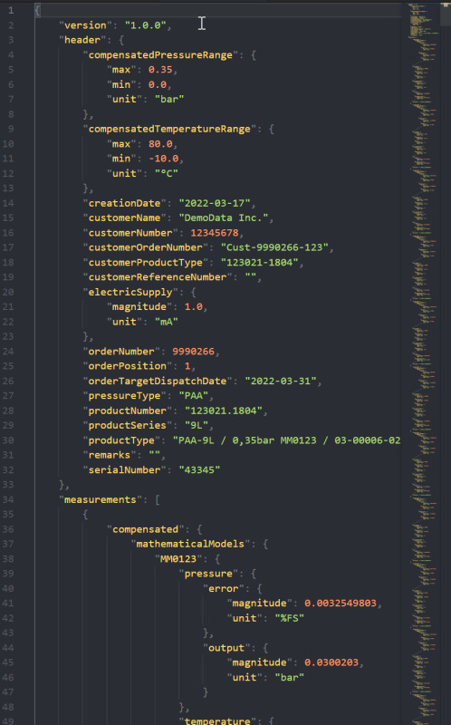

Table of Contents
=================

   [1) Overview](#1-overview)  
   [2) Web App](#2-web-app)  
   [3) Web API](#3-web-api)  
   [4) The JSON Schema](#4-the-json-schema)  
   [5) Sample Software](#5-sample-software)  
   [6) FAQ](#6-faq)  
   [7) Roadmap](#7-roadmap)
   [8) Release Notes](#8-release-notes)

---

## 1) Overview

KELLER's «myCalibration» is a data-platform for KELLER customers. Via KELLER «myCalibration», customers can access digital calibration data of their KELLER sensors.

### Data



#### Contents

«myCalibration» is designed with data from various KELLER transducers and transmitters in mind. As an example, it can be used to hold information of Mathematical Compensation Models as well as X-line transmitter calibration data.

#### Format

Calibration data is available in JSON file format. Thanks to its widespread use and a broad availability of programming libraries, this format allows for an easy and quick integration in customer software. What is more, as a quick check, JSON data can be inspected in any text editor.

#### Structure

The structure of the JSON file is defined in a JSON schema. This schema is made publicly available, allowing a full integration in customer software.

### Access

#### Web App

A user interface that is accessible over any standard web browser gives customers access to calibration data of their sensors. Customer data is only accessible after an individual login and cannot be seen by others.
After using various search and filter functionalities, the user can download calibration data of individually selected sensors or perform a bulk download of multiple datasets.

#### Web API

A REST API is available for automated access. Customers can integrate this API into their processes. This allows them e.g. to automatically download the calibration data of newly received sensors and integrate this into their production processes.

---

## 2) Web App

The web app is here: [https://mycalibration.azurewebsites.net/](https://mycalibration.azurewebsites.net)


There is a free demo user account with the username '*Demo1234*' and the password '*Demo1234*'.

### Sign Up & Sign In

Signing up a user account can be done with the help of engineering@keller-druck.com
There is already a free demo account '**Demo1234**' with the password '**Demo1234**' to see some demo data.  


---

## 3) Web API

The Web API's URL is [https://mycalibrationapi.azurewebsites.net](https://mycalibrationapi.azurewebsites.net)

The OpenAPI specification page is: [https://mycalibrationapi.azurewebsites.net/swagger/index.html](https://mycalibrationapi.azurewebsites.net/swagger/index.html)

All the calibration data can be exported as

- JSON meta-information (header only)
- zip file with the filtered and compressed JSON files (header+data)

The Swagger JSON file can be found here: [https://mycalibrationapi.azurewebsites.net/swagger/v1/swagger.json](https://mycalibrationapi.azurewebsites.net/swagger/v1/swagger.json)

### Most important API endpoints

#### GET /v1/CalibrationData/Headers

Responds with the meta-information(header-part) about accessible calibration data. See [Header data](#mefistoviewmodel).

| Name | Located in | Description | Required | Schema |
| ---- | ---------- | ----------- | -------- | ---- |
| skip | query | OPTIONAL. Skips the given number of rows. The opposite of Take. | No | integer |
| take | query | OPTIONAL. Takes only the first .. rows of meta information. The opposite of Skip. When not specified the API tries to get all rows. | No | integer |

#### GET /v1/CalibrationData

Responds with the complete calibration data in JSON form. See [filter parameters](#filter-parameters). The query can be filtered. See [filter parameters](#filter-parameters).

#### GET /v1/CalibrationData/Export

Exports the filtered calibration data as ZIP (or BROTLI) file with the calibration files (JSON). As a result, a download link is replied. *Brotli-file-type is not supported as of now.*

| Name | Located in | Description | Required | Schema |
| ---- | ---------- | ----------- | -------- | ---- |
| fileType | query | 1 = All calibration data items will be merged in one JSON list  2 = All calibration data items will be merged in one JSON list. This JSON file will be compressed to zip file  3 = Every calibration data items will stored as JSON file. All these files will be compressed to one single zip file  4 = Every calibration data items will stored as JSON file. All these files will be compressed to one single brotli file | No | [ExportFileType](#ExportFileType) |

plus all [filter parameters](#filter-parameters)

#### GET /v1/CalibrationData/Count

Get the count of the calibration data set based on the optional search parameters. See [filter/search parameters](#filter-parameters).
If optionalSearchParameter or its fields are null then the returned number is the amount of all sensors the account has access to.
You can use this to quickly find out how many files you request with a given query.

#### GET /v1/CalibrationData/List

Get a list of all identifier strings of the calibration data set defined by the optional search parameters. See [filter/search parameters](#filter-parameters).
These identifier strings (***IncludedIds***) can then used as input as filter parameter for a query in ***GET /v1/CalibrationData***

### PUT /v1/CalibrationData/New

WARNING: Only use when you know what you do. Better ask engineering@keller-druck.com
Gathers all NEW data. 'New data' is calibration data that was never requested with this request. A second request might return an empty list.
Optionally, if the new data could not be stored, then with 'countOfHoursDataWasAlreadyRequested' the data requested will be shown again back to the given hours.
Optionally, 'countOfHoursDataWasAlreadyAssigned' can be used

| Name | Located in | Description | Required | Schema |
| ---- | ---------- | ----------- | -------- | ---- |
| take | query |  | No | integer |
| countOfHoursDataWasAlreadyRequested | query |  | No | integer |
| countOfHoursDataWasAlreadyAssigned | query |  | No | integer |

### MefistoViewModel

Mefisto = MEtainfo for FIle STOrage
Example:

```
{
  "id": 28651,
  "customerName": "DemoData Inc.",
  "customerNumber": 12345678,
  "subCustomerNumber": 0,
  "remarks": "",
  "serialNumber": "23650",
  "productNumber": "123856.1113",
  "productType": "PA-23R",
  "pressureType": "Pa",
  "productSeries": "23R",
  "compensatedTemperatureRangeMin": 15.0,
  "compensatedTemperatureRangeMax": 70.0,
  "compensatedTemperatureRangeUnit": "C",
  "compensatedPressureRangeMin": 0.0,
  "compensatedPressureRangeMax": 1.0,
  "compensatedPressureRangeUnit": "Bar",
  "electricSupplyMin": 4.5,
  "electricSupplyMax": 24.0,
  "electricSupplyMagnitude": 0.0,
  "electricSupplyUnit": "V",
  "orderNumber": 9990740,
  "orderPosition": 1,
  "orderTargetDispatchDate": "2017-05-26T00:00:00",
  "customerOrderNumber": "Cust-9990740-123",
  "customerReferenceNumber": "ABC",
  "customerProductType": "123451-1113",
  "subCustomerOrderNumber": null,
  "subCustomerOrderPosition": null,
  "assignedToSubCustomerDateUtc": null
}
```

| Name | Type | Description |
| ---- | ---- | ----------- |
|Id | Integer | internal id                                                                                                    |
|CustomerName | String | Customer name                                                                                         |
|CustomerNumber | Integer | KELLER customer identification number                                                              |
|SubCustomerNumber | Integer | KELLER customer identification number for a customer of a customer                              |
|Remarks | String | File creation date (UTC)                                                                                   |
|SerialNumber | String | KELLER product serial number                                                                          |
|ProductNumber | String | KELLER product number                                                                                |
|ProductType | String | KELLER product type                                                                                    |
|PressureType | String | KELLER product pressure type                                                                          |
|ProductSeries | String | KELLER product series                                                                                |
|CompensatedTemperatureRangeMin | Double | Temperature range over which the sensors characteristics have been compensated <br /> Min  |
|CompensatedTemperatureRangeMax | Double | Temperature range over which the sensors characteristics have been compensated <br /> Max  |
|CompensatedTemperatureRangeUnit | String | Temperature range over which the sensors characteristics have been compensated U<br /> nit|
|CompensatedPressureRangeMin | Double | Pressure range over which the sensors characteristics have been compensated <br /> Min        |
|CompensatedPressureRangeMax | Double | Pressure range over which the sensors characteristics have been compensated <br /> Max        |
|CompensatedPressureRangeUnit | String | Pressure range over which the sensors characteristics have been compensated <br /> Unit      |
|ElectricSupplyMin | Double | Nominal electric supply Min                                                                      |
|ElectricSupplyMax | Double | Nominal electric supply Max                                                                      |
|ElectricSupplyMagnitude | Double | Nominal electric supply Magnitude                                                          |
|ElectricSupplyUnit | String | Nominal electric supply Unit                                                                    |
|OrderNumber | Integer | KELLER purchase order number                                                                          |
|OrderPosition | Integer | KELLER purchase order position                                                                      |
|OrderTargetDispatchDate | Date | Targeted dispatch date of the order                                                          |
|CustomerOrderNumber | String | Customer internal purchase order number                                                        |
|CustomerReferenceNumber | String | Customer internal reference number                                                         |
|CustomerProductType | String | Customer internal product type                                                                 |
|SubCustomerOrderNumber | String | Invoice Number from the Customer for the SubCustomer                                        |
|SubCustomerOrderPosition | String | Additional order details for the SubCustomer from the Customer. Eg.\"Invoice Line\"       |
|AssignedToSubCustomerDateUtc | Date | Timestamp of the moment the data was assigned to a sub customer                         |

### Filter parameters

| Name | Located in | Description | Required | Schema  |
| ---- | ---------- | ----------- | -------- | ------- |
| IncludedIds | query | If null: Either are 'ALL SELECTED' or some are unselected (and listed in ExcludedIds)<br />  If not null: None are selected except those that are listed here.<br />  It is not allowed to have IncludedIds AND ExcludedIds have listed values. One most be null or both most be null.<br />  The list of included ids is limited to 50. More than 50 will throw an exception.<br /> | No | [ string ] |
| ExcludedIds | query | If null: Either are 'ALL SELECTED' or only some few are selected (and listed in IncludedIds)<br />  If not null: All are selected and except those that are listed here.<br />  It is not allowed to have IncludedIds AND ExcludedIds have listed values. One most be null or both most be null.<br />  The list of excluded ids is limited to 50. More than 50 will throw an exception.<br /> | No | [ string ] |
| OrderNumbers | query | List of Order Numbers | No | [ string ] |
| OrderPositions | query | List of Order Positions | No | [ string ] |
| DateFilterType | query | One of 'equals', 'greaterThan', 'lessThan', 'notEqual', 'inRange'.<br />  When 'inRange' then 'DateTo' is needed.<br />  Example 1:<br />  "All data newer than August 1st" = <https://mycalibrationapi.azurewebsites.net/v1/CalibrationData?DateFilterType=greaterThan&Date=2021-08-01><br />  Example 2:<br />  "All data from the year 2020" = <https://mycalibrationapi.azurewebsites.net/v1/CalibrationData?DateFilterType=inRange&Date=2021-01-01&DateTo=2021-12-31> <br />  Example 3:<br />  "All data from the first day in January and February" = <https://mycalibrationapi.azurewebsites.net/v1/CalibrationData?DateFilterType=equals&Date=2021-01-01&Date=2021-02-01> <br /> | No | string |
| Date | query | Dispatch-date text in format 'yyyy-MM-dd' eg. "2021-12-24"<br />  Normally, this is a list with one element. Nevertheless, it is possible to GET calibration data from multiple dates. In this case DateFilterType must be 'equals' and DateTo must be null. | No | [ string ] |
| DateTo | query | Used when DateFilterType is 'inRange'.<br />  Data is gathered from 'Date' to 'DateTo'<br />  Date text in format 'yyyy-MM-dd' eg. "2021-12-24" | No | string |
| CustomerProductTypes | query | To search for [Blanks] use "blank" | No | [ string ] |
| PressureTypes | query | Eg. ["pa","paa","pr"]  To see all possible enum strings, go to <https://mycalibration.github.io/#filter-parameters> | No | [ string ] |
| ProductSeries | query | Eg. ["10LHP","25Y","46X","K-102"] | No | [ string ] |
| ProductNumbers | query |  | No | [ string ] |
| SerialNumberSearchText | query | Use this to find all SerialNumbers that contains this text content. | No | string |
| PressureMinFilterType | query | One of 'equals', 'greaterThan', 'lessThan', 'notEqual', 'inRange', 'lessThanOrEqual', 'greaterThanOrEqual'.<br />  When 'inRange' then 'PressureMinTo' is needed. | No | string |
| PressureMin | query | The exclusive lower bound of the "Minimum Pressure" | No | double |
| PressureMinTo | query | The exclusive upper bound of the "Minimum Pressure".<br />  Used when PressureMinFilterType is 'inRange'.<br />  Data is gathered from 'PressureMin' to 'PressureMinTo'.<br />  Date text in format 'yyyy-MM-dd' eg. "2021-12-24"<br /> | No | double |
| PressureMaxFilterType | query | One of 'equals', 'greaterThan', 'lessThan', 'notEqual', 'inRange', 'lessThanOrEqual', 'greaterThanOrEqual'.<br />  When 'inRange' then 'PressureMaxTo' is needed. | No | string |
| PressureMax | query | The exclusive lower bound of the "Maximum Pressure" | No | double |
| PressureMaxTo | query | The exclusive upper bound of the "Maximum Pressure"<br />  Used when PressureMaxFilterType is 'inRange'.<br />  Data is gathered from 'PressureMax' to 'PressureMaxTo'<br />  Date text in format 'yyyy-MM-dd' eg. "2021-12-24" | No | double |
| PressureUnit | query | <list type="string">List of the Pressure Unit</list> | No | [ string ] |
| TemperatureMinFilterType | query | One of 'equals', 'greaterThan', 'lessThan', 'notEqual', 'inRange', 'lessThanOrEqual', 'greaterThanOrEqual'.<br />  When 'inRange' then 'TemperatureMinTo' is needed. | No | string |
| TemperatureMin | query | The exclusive lower bound of the "Minimum Temperature" | No | double |
| TemperatureMinTo | query | The exclusive upper bound of the "Minimum Temperature"<br />  Used when TemperatureMinFilterType is 'inRange'.<br />  Data is gathered from 'TemperatureMin' to 'TemperatureMinTo'<br />  Date text in format 'yyyy-MM-dd' eg. "2021-12-24" | No | double |
| TemperatureMaxFilterType | query | One of 'equals', 'greaterThan', 'lessThan', 'notEqual', 'inRange', 'lessThanOrEqual', 'greaterThanOrEqual'.<br />  When 'inRange' then 'TemperatureMaxTo' is needed. | No | string |
| TemperatureMax | query | The exclusive lower bound of the "Maximum Temperature" | No | double |
| TemperatureMaxTo | query | The exclusive upper bound of the "Maximum Temperature"<br />  Used when TemperatureMaxFilterType is 'inRange'.<br />  Data is gathered from 'TemperatureMax' to 'TemperatureMaxTo'<br />  Date text in format 'yyyy-MM-dd' eg. "2021-12-24" | No | double |
| TemperatureUnit | query | <list type="string">List of the Temperature Unit</list> | No | [ string ] |
| SupplyMinFilterType | query | One of 'equals', 'greaterThan', 'lessThan', 'notEqual', 'inRange', 'lessThanOrEqual', 'greaterThanOrEqual'.<br />  When 'inRange' then 'SupplyMinTo' is needed.<br />  Either Min/Max is used or Magnitude.<br /> | No | string |
| SupplyMin | query | The exclusive lower bound of the "Minimum Supply"<br />  Either Min/Max is used or Magnitude. | No | double |
| SupplyMinTo | query | The exclusive upper bound of the "Minimum Supply"<br />  Used when SupplyMinFilterType is 'inRange'.<br />  Data is gathered from 'SupplyMin' to 'SupplyMinTo'<br />  Date text in format 'yyyy-MM-dd' eg. "2021-12-24"<br />  Either Min/Max is used or Magnitude. | No | double |
| SupplyMaxFilterType | query | One of 'equals', 'greaterThan', 'lessThan', 'notEqual', 'inRange', 'lessThanOrEqual', 'greaterThanOrEqual'.<br />  When 'inRange' then 'SupplyMaxTo' is needed.<br />  Either Min/Max is used or Magnitude. | No | string |
| SupplyMax | query | The exclusive lower bound of the "Maximum Supply"<br />  Either Min/Max is used or Magnitude. | No | double |
| SupplyMaxTo | query | The exclusive upper bound of the "Maximum Supply"<br />  Used when SupplyMaxFilterType is 'inRange'.<br />  Data is gathered from 'SupplyMax' to 'SupplyMaxTo'<br />  Date text in format 'yyyy-MM-dd' eg. "2021-12-24"<br />  Either Min/Max is used or Magnitude. | No | double |
| SupplyMagnitudeFilterType | query | One of 'equals', 'greaterThan', 'lessThan', 'notEqual', 'inRange', 'lessThanOrEqual', 'greaterThanOrEqual'.<br />  When 'inRange' then 'SupplyMagnitudeTo' is needed.<br />  Either Min/Max is used or Magnitude. | No | string |
| SupplyMagnitude | query | The exclusive lower bound of the "Supply Magnitude"<br />  Either Min/Max is used or Magnitude. | No | double |
| SupplyMagnitudeTo | query | The exclusive upper bound of the "Supply Magnitude"<br />  Used when SupplyMagnitudeFilterType is 'inRange'.<br />  Data is gathered from 'SupplyMagnitude' to 'SupplyMagnitudeTo'<br />  Either Min/Max is used or Magnitude. | No | double |
| SupplyUnit | query | <list type="string">List of the Supply Unit</list> | No | [ string ] |
| CustomerReferenceNumberSearchText | query | Find all data with contains this search text | No | string |
| CustomerOrderNumberSearchText | query | Find all data with contains this search text | No | string |
| RemarksSearchText | query | Find all data with contains this search text | No | string |

#### Filter parameters - PhysicalUnits & PressureTypes

#### Filter parameters - PhysicalUnits : PressureUnit, TemperatureUnit, SupplyUnit

Although '*%FS*' is shown in the UI and listed in the JSON, the API parameter string used is '*Fs*'.

```
 ________________________
|          |             |
|   Unit   |  API string |
|__________|_____________|
|  %FS     |  Fs         |
|  A       |  A          |
|  K       |  K          |
|  MOhm    |  MOhm       |
|  MPa     |  MPa        |
|  Ohm     |  Ohm        |
|  Pa      |  Pa         |
|  Torr    |  Torr       |
|  V       |  V          |
|  VDC     |  VDC        |
|  atm     |  Atm        |
|  bar     |  Bar        |
|  cmH2O   |  CmH2O      |
|  cmHg    |  CmHg       |
|  ftH2O   |  FtH2O      |
|  hPa     |  HPa        |
|  inH2O   |  InH2O      |
|  inHg    |  InHg       |
|  kN/m2   |  KNM2       |
|  kOhm    |  KOhm       |
|  kPa     |  KPa        |
|  kp/cm2  |  KpCm2      |
|  lbf/ft2 |  LbfFt2     |
|  mA      |  MA         |
|  mH2O    |  MH2O       |
|  mV      |  MV         |
|  mV/V    |  MVV        |
|  mV/mA   |  MVMA       |
|  mbar    |  Mbar       |
|  mmH2O   |  MmH2O      |
|  mmHg    |  MmHg       |
|  psi     |  Psi        |
|  °C      |  C          |
|________________________|
```

##### Filter parameters - PressureTypes

Although '*PA*' is shown in the UI and listed in the JSON, the API parameter string used is '*Pa*'.

```
 ______________________
|        |             |
|  Unit  |  API string |
|________|_____________|
|  PA    |  Pa         |
|  PAA   |  Paa        |
|  PD    |  Pd         |
|  PR    |  Pr         |
|  PRD   |  Prd        |
|______________________|
```

### Example queries

TODO

### Generate client SW using the OpenAPI/swagger schema

[https://editor.swagger.io/](https://editor.swagger.io/)

---

## 4) The JSON Schema

The schema can be downloaded as JSON Schema [here](https://github.com/mycalibration/mycalibration.github.io/blob/main/schema/keller-sensor-data.schema.json). And converted to various other file types [here](https://editor.swagger.io/).

| Root objects |  Explanation |
| ------------ | ------------ |
| Version |  Version string for the schema with semantic versioning (MAJOR.MINOR.PATCH)  E.g. "1.0.0" |
| Header |  Meta-information data to identify the sensor data |
| CompensationMethods | MathMod data |
| Measurements | Measurements point of the T/P-calibration-curve |


<style type="text/css">
.tg  {border-collapse:collapse;border-spacing:0;}
.tg td{border-color:black;border-style:solid;border-width:1px;font-family:Arial, sans-serif;font-size:14px;
  overflow:hidden;padding:10px 5px;word-break:normal;}
.tg th{border-color:black;border-style:solid;border-width:1px;font-family:Arial, sans-serif;font-size:14px;
  font-weight:normal;overflow:hidden;padding:10px 5px;word-break:normal;}
.tg .tg-0lax{text-align:left;vertical-align:top}
</style>
<table class="tg">
<thead>
  <tr>
    <th class="tg-0lax">Root object</th>
    <th class="tg-0lax">Object</th>
    <th class="tg-0lax">Schema Description</th>
    <th class="tg-0lax">Explanation</th>
    <th class="tg-0lax">Type</th>
    <th class="tg-0lax">Example</th>
  </tr>
</thead>
<tbody>
  <tr>
    <td class="tg-0lax">version *</td>
    <td class="tg-0lax"> </td>
    <td class="tg-0lax">Version&nbsp;of the corresponding JSON Schema</td>
    <td class="tg-0lax">Version&nbsp;for the schema with semantic versioning (MAJOR.MINOR.PATCH)</td>
    <td class="tg-0lax">string</td>
    <td class="tg-0lax">"1.0.0"</td>
  </tr>
  <tr>
    <td class="tg-0lax" rowspan="23">header&nbsp;*</td>
    <td class="tg-0lax"> </td>
    <td class="tg-0lax">Header data</td>
    <td class="tg-0lax">Meta-information&nbsp;to identify and catalogize the calibration data stored in measurements</td>
    <td class="tg-0lax"> </td>
    <td class="tg-0lax"> </td>
  </tr>
  <tr>
    <td class="tg-0lax">creationDate</td>
    <td class="tg-0lax">File creation date</td>
    <td class="tg-0lax"> </td>
    <td class="tg-0lax">string</td>
    <td class="tg-0lax">"2022-03-22"</td>
  </tr>
  <tr>
    <td class="tg-0lax">orderTargetDispatchDate&nbsp;*</td>
    <td class="tg-0lax">Targeted&nbsp;dispatch date of the order</td>
    <td class="tg-0lax"> </td>
    <td class="tg-0lax">string</td>
    <td class="tg-0lax">"2022-03-15"</td>
  </tr>
  <tr>
    <td class="tg-0lax">orderNumber&nbsp;*</td>
    <td class="tg-0lax">KELLER purchase order&nbsp;number</td>
    <td class="tg-0lax"> </td>
    <td class="tg-0lax">int</td>
    <td class="tg-0lax">9990016</td>
  </tr>
  <tr>
    <td class="tg-0lax">orderPosition&nbsp;*</td>
    <td class="tg-0lax">KELLER purchase order&nbsp;position</td>
    <td class="tg-0lax"> </td>
    <td class="tg-0lax">int</td>
    <td class="tg-0lax">3</td>
  </tr>
  <tr>
    <td class="tg-0lax">customerProductType&nbsp;*</td>
    <td class="tg-0lax">Customer internal product&nbsp;type</td>
    <td class="tg-0lax"> </td>
    <td class="tg-0lax">string</td>
    <td class="tg-0lax">"9990016-123"</td>
  </tr>
  <tr>
    <td class="tg-0lax">pressureType&nbsp;*</td>
    <td class="tg-0lax">Pressure type</td>
    <td class="tg-0lax"> </td>
    <td class="tg-0lax">string</td>
    <td class="tg-0lax">"PAA"</td>
  </tr>
  <tr>
    <td class="tg-0lax">productSeries&nbsp;*</td>
    <td class="tg-0lax">KELLER product series</td>
    <td class="tg-0lax"> </td>
    <td class="tg-0lax">string</td>
    <td class="tg-0lax">"33X"</td>
  </tr>
  <tr>
    <td class="tg-0lax">productType&nbsp;*</td>
    <td class="tg-0lax">KELLER product type</td>
    <td class="tg-0lax"> </td>
    <td class="tg-0lax">string</td>
    <td class="tg-0lax">"PAA-33X"</td>
  </tr>
  <tr>
    <td class="tg-0lax">productNumber&nbsp;*</td>
    <td class="tg-0lax">KELLER product number</td>
    <td class="tg-0lax"> </td>
    <td class="tg-0lax">string</td>
    <td class="tg-0lax">"1234567.0001"</td>
  </tr>
  <tr>
    <td class="tg-0lax">serialNumber&nbsp;*</td>
    <td class="tg-0lax">KELLER product serial&nbsp;number</td>
    <td class="tg-0lax"> </td>
    <td class="tg-0lax">string</td>
    <td class="tg-0lax">"I123456"</td>
  </tr>
  <tr>
    <td class="tg-0lax">compensatedPressureRange&nbsp;*</td>
    <td class="tg-0lax">Pressure&nbsp;range over which the sensors characteristics have been compensated</td>
    <td class="tg-0lax"> </td>
    <td class="tg-0lax">object</td>
    <td class="tg-0lax">{"max":&nbsp;1.0,"min": 0.0,"unit": "bar"}</td>
  </tr>
  <tr>
    <td class="tg-0lax">compensatedTemperatureRange&nbsp;*</td>
    <td class="tg-0lax">Temperature&nbsp;range over which the sensors characteristics have been compensated</td>
    <td class="tg-0lax"> </td>
    <td class="tg-0lax">object</td>
    <td class="tg-0lax">{"max":&nbsp;70.0,  "min": 15.0, "unit": "°C"}</td>
  </tr>
  <tr>
    <td class="tg-0lax" rowspan="5">electricSupply&nbsp;*</td>
    <td class="tg-0lax" rowspan="5">Nominal electric supply</td>
    <td class="tg-0lax" rowspan="5"> <br><br><br><br></td>
    <td class="tg-0lax" rowspan="5">object</td>
    <td class="tg-0lax" rowspan="5">{"unit":&nbsp;"V","max": 24.0,"min": 4.5} or&nbsp;{"unit": "mA","magnitude": 1.0}</td>
  </tr>
  <tr>
  </tr>
  <tr>
  </tr>
  <tr>
  </tr>
  <tr>
  </tr>
  <tr>
    <td class="tg-0lax">customerReferenceNumber&nbsp;*</td>
    <td class="tg-0lax">Customer internal reference&nbsp;number</td>
    <td class="tg-0lax"> </td>
    <td class="tg-0lax">string</td>
    <td class="tg-0lax">"Jane&nbsp;Doe"</td>
  </tr>
  <tr>
    <td class="tg-0lax">remarks&nbsp;*</td>
    <td class="tg-0lax"> </td>
    <td class="tg-0lax"> </td>
    <td class="tg-0lax">string</td>
    <td class="tg-0lax">""</td>
  </tr>
  <tr>
    <td class="tg-0lax">customerName&nbsp;*</td>
    <td class="tg-0lax">Customer name</td>
    <td class="tg-0lax"> </td>
    <td class="tg-0lax">string</td>
    <td class="tg-0lax">"DemoData Inc."</td>
  </tr>
  <tr>
    <td class="tg-0lax">customerNumber&nbsp;*</td>
    <td class="tg-0lax">KELLER customer&nbsp;identification number</td>
    <td class="tg-0lax"> </td>
    <td class="tg-0lax">string</td>
    <td class="tg-0lax">"9990016 Rev. 2"</td>
  </tr>
  <tr>
    <td class="tg-0lax">customerOrderNumber&nbsp;*</td>
    <td class="tg-0lax">Customer&nbsp;internal purchase order number</td>
    <td class="tg-0lax"> </td>
    <td class="tg-0lax"> </td>
    <td class="tg-0lax">"123456700012"</td>
  </tr>
  <tr>
    <td class="tg-0lax" rowspan="27">measurements[] *</td>
    <td class="tg-0lax"> </td>
    <td class="tg-0lax">Array&nbsp;of individual measurements. Item order corresponds to order in measurement&nbsp;sequence.</td>
    <td class="tg-0lax"> </td>
    <td class="tg-0lax">Array of Measurement</td>
    <td class="tg-0lax"> </td>
  </tr>
  <tr>
    <td class="tg-0lax">reference *</td>
    <td class="tg-0lax">KELLER&nbsp;reference to original measurement data</td>
    <td class="tg-0lax"> </td>
    <td class="tg-0lax">string</td>
    <td class="tg-0lax">"TSX_ABCD567P89"</td>
  </tr>
  <tr>
    <td class="tg-0lax">environment&nbsp;*</td>
    <td class="tg-0lax">Real&nbsp;conditions of the measurement point environment</td>
    <td class="tg-0lax"> </td>
    <td class="tg-0lax">object</td>
    <td class="tg-0lax">{<br>&nbsp;&nbsp;&nbsp;    "pressure": {<br>&nbsp;&nbsp;&nbsp;        "magnitude": 0.1000031,<br>&nbsp;&nbsp;&nbsp;        "unit": "bar"<br>&nbsp;&nbsp;&nbsp;    },<br>&nbsp;&nbsp;&nbsp;    "temperature": {<br>&nbsp;&nbsp;&nbsp;        "magnitude": 14.6304,<br>&nbsp;&nbsp;&nbsp;        "unit": "°C"<br>&nbsp;&nbsp;&nbsp;    },<br>&nbsp;&nbsp;&nbsp;    "barometer": {<br>&nbsp;&nbsp;&nbsp;        "magnitude": 0.970963,<br>&nbsp;&nbsp;&nbsp;        "unit": "bar"<br>&nbsp;&nbsp;&nbsp;    }<br>&nbsp;&nbsp;&nbsp;}</td>
  </tr>
  <tr>
    <td class="tg-0lax">environmentTarget</td>
    <td class="tg-0lax">Target&nbsp;conditions of the measurement point environment</td>
    <td class="tg-0lax"> </td>
    <td class="tg-0lax">object</td>
    <td class="tg-0lax">{<br>&nbsp;&nbsp;&nbsp;    "pressure": {<br>&nbsp;&nbsp;&nbsp;        "magnitude": 0.1,<br>&nbsp;&nbsp;&nbsp;        "unit": "bar"<br>&nbsp;&nbsp;&nbsp;    },<br>&nbsp;&nbsp;&nbsp;    "temperature": {<br>&nbsp;&nbsp;&nbsp;        "magnitude": 15,<br>&nbsp;&nbsp;&nbsp;        "unit": "°C"<br>&nbsp;&nbsp;&nbsp;    }<br>&nbsp;&nbsp;&nbsp;}</td>
  </tr>
  <tr>
    <td class="tg-0lax">raw</td>
    <td class="tg-0lax">Raw measurement values</td>
    <td class="tg-0lax"> </td>
    <td class="tg-0lax">object</td>
    <td class="tg-0lax">{<br>&nbsp;&nbsp;&nbsp;    "bridgeResistance": {<br>&nbsp;&nbsp;&nbsp;       &nbsp;"magnitude": 3391.10116554,<br>&nbsp;&nbsp;&nbsp;       &nbsp;"unit": "Ohm"<br>&nbsp;&nbsp;&nbsp;    },<br>&nbsp;&nbsp;&nbsp;    "signal": {<br>&nbsp;&nbsp;&nbsp;       &nbsp;"magnitude": 24.238461872,<br>&nbsp;&nbsp;&nbsp;        "unit":&nbsp;"mV"<br>&nbsp;&nbsp;&nbsp;    }<br>&nbsp;&nbsp;&nbsp;}</td>
  </tr>
  <tr>
    <td class="tg-0lax" rowspan="22">compensated</td>
    <td class="tg-0lax" rowspan="22">Compensated&nbsp;measurement data by different compensation methods</td>
    <td class="tg-0lax" rowspan="22"> <br><br><br><br><br><br><br><br><br><br><br><br><br><br><br><br><br><br><br><br><br></td>
    <td class="tg-0lax" rowspan="22">object</td>
    <td class="tg-0lax" rowspan="22">{<br>&nbsp;&nbsp;&nbsp;    "compensationCircuitOutputs": {<br>&nbsp;&nbsp;&nbsp;        "P1": {<br>&nbsp;&nbsp;&nbsp;            "measuredValue":&nbsp;{<br>&nbsp;&nbsp;&nbsp;               &nbsp;"magnitude": 0.03000106,<br>&nbsp;&nbsp;&nbsp;                "unit":&nbsp;"bar"<br>&nbsp;&nbsp;&nbsp;            },<br>&nbsp;&nbsp;&nbsp;            "nominalValue":&nbsp;"magnitude": 0.02999711,<br>&nbsp;&nbsp;&nbsp;            "unit":&nbsp;"bar"<br>&nbsp;&nbsp;&nbsp;        }<br>&nbsp;&nbsp;&nbsp;    },<br>&nbsp;&nbsp;&nbsp;    "TOB1": {<br>&nbsp;&nbsp;&nbsp;        "measuredValue": {<br>&nbsp;&nbsp;&nbsp;            "magnitude":&nbsp;14.59302,<br>&nbsp;&nbsp;&nbsp;            "unit":&nbsp;"°C"<br>&nbsp;&nbsp;&nbsp;        },<br>&nbsp;&nbsp;&nbsp;        "nominalValue": {<br>&nbsp;&nbsp;&nbsp;            "magnitude":&nbsp;14.6313,<br>&nbsp;&nbsp;&nbsp;            "unit":&nbsp;"°C"<br>&nbsp;&nbsp;&nbsp;        }<br>&nbsp;&nbsp;&nbsp;    }<br>&nbsp;&nbsp;&nbsp;}</td>
  </tr>
  <tr>
  </tr>
  <tr>
  </tr>
  <tr>
  </tr>
  <tr>
  </tr>
  <tr>
  </tr>
  <tr>
  </tr>
  <tr>
  </tr>
  <tr>
  </tr>
  <tr>
  </tr>
  <tr>
  </tr>
  <tr>
  </tr>
  <tr>
  </tr>
  <tr>
  </tr>
  <tr>
  </tr>
  <tr>
  </tr>
  <tr>
  </tr>
  <tr>
  </tr>
  <tr>
  </tr>
  <tr>
  </tr>
  <tr>
  </tr>
  <tr>
  </tr>
  <tr>
    <td class="tg-0lax" rowspan="3">compensationMethods</td>
    <td class="tg-0lax"> </td>
    <td class="tg-0lax">Information on different&nbsp;compensation methods</td>
    <td class="tg-0lax"> </td>
    <td class="tg-0lax"> </td>
    <td class="tg-0lax"> </td>
  </tr>
  <tr>
    <td class="tg-0lax">mathematicalModel</td>
    <td class="tg-0lax">A mathematical compensation&nbsp;model</td>
    <td class="tg-0lax"> </td>
    <td class="tg-0lax">object</td>
    <td class="tg-0lax">{<br>&nbsp;&nbsp;&nbsp;    "MM0324": {<br>&nbsp;&nbsp;&nbsp;        "compensatedPressureRange": {<br>&nbsp;&nbsp;&nbsp;            "max": 0.35,<br>&nbsp;&nbsp;&nbsp;            "min": 0.03,<br>&nbsp;&nbsp;&nbsp;            "unit":&nbsp;"bar"<br>&nbsp;&nbsp;&nbsp;        },<br>&nbsp;&nbsp;&nbsp;        "compensatedTemperatureRange":&nbsp;{<br>&nbsp;&nbsp;&nbsp;            "max": 80.0,<br>&nbsp;&nbsp;&nbsp;            "min": -10.0,<br>&nbsp;&nbsp;&nbsp;            "unit":&nbsp;"°C"<br>&nbsp;&nbsp;&nbsp;        },<br>&nbsp;&nbsp;&nbsp;        "electricSupply": {<br>&nbsp;&nbsp;&nbsp;            "magnitude": 1.0,<br>&nbsp;&nbsp;&nbsp;            "unit":&nbsp;"mA"<br>&nbsp;&nbsp;&nbsp;        },<br>&nbsp;&nbsp;&nbsp;        "modelType":&nbsp;"MM0324",<br>&nbsp;&nbsp;&nbsp;        "parts": {<br>&nbsp;&nbsp;&nbsp;            "pressure": {<br>&nbsp;&nbsp;&nbsp;           &nbsp;    "coefficients": [[1.8578428692012365,&nbsp;-0.0017637338444390805, 6.089070597524738E-07, -9.469256273591509E-11,&nbsp;5.4899128873639585E-15],<br>&nbsp;&nbsp;&nbsp; [-0.0972735455799812, 0.00010464739112826799,&nbsp;-3.9404534306891384E-08, 6.5906859977677644E-12, -4.1433054700020206E-16],&nbsp;... etc. ]<br>&nbsp;&nbsp;&nbsp;               &nbsp;"description": "P  = f(Sig,R)",<br>&nbsp;&nbsp;&nbsp;                "inputs":&nbsp;["Sig", "Rb"],<br>&nbsp;&nbsp;&nbsp;                "output":&nbsp;"P"<br>&nbsp;&nbsp;&nbsp;            },<br>&nbsp;&nbsp;&nbsp;            "temperature": {<br>&nbsp;&nbsp;&nbsp;           &nbsp;    "coefficients": [[-7875.716974895135,&nbsp;4.720765539450497, -0.036522641391128374], [7.760050026358172, ...etc.&nbsp;],],<br>&nbsp;&nbsp;&nbsp;               &nbsp;"description": "T  = f(R,Sig)",<br>&nbsp;&nbsp;&nbsp;                "inputs":&nbsp;["Rb", "Sig"],<br>&nbsp;&nbsp;&nbsp;                "output":&nbsp;"T"<br>&nbsp;&nbsp;&nbsp;            }<br>&nbsp;&nbsp;&nbsp;        }<br>&nbsp;&nbsp;&nbsp;    }<br>&nbsp;&nbsp;&nbsp;}</td>
  </tr>
  <tr>
    <td class="tg-0lax">compensationCircuit</td>
    <td class="tg-0lax">Compensation circuit</td>
    <td class="tg-0lax"> </td>
    <td class="tg-0lax">object</td>
    <td class="tg-0lax">&nbsp;&nbsp;&nbsp;{<br>&nbsp;&nbsp;&nbsp;    "outputs": {<br>&nbsp;&nbsp;&nbsp;        "P1": {<br>&nbsp;&nbsp;&nbsp;            "description":&nbsp;"Pressure 1"<br>&nbsp;&nbsp;&nbsp;        },<br>&nbsp;&nbsp;&nbsp;        "TOB1": {<br>&nbsp;&nbsp;&nbsp;            "description":&nbsp;"Temperature 1"<br>&nbsp;&nbsp;&nbsp;        }<br>&nbsp;&nbsp;&nbsp;    },<br>&nbsp;&nbsp;&nbsp;    "description": "5432109.0004"<br>&nbsp;&nbsp;&nbsp;}</td>
  </tr>
</tbody>
</table>

---

## 5) Sample Software

Github repo: [https://github.com/mycalibration/mycalibration.github.io/](https://github.com/mycalibration/mycalibration.github.io/)

- **/docs**  *- Content of the documentation page <https://mycalibration.github.io/>*
- **/samples**
  - **/api**
    - [**/csharp-dotnet/simple**](https://github.com/mycalibration/mycalibration.github.io/tree/main/samples/api/csharp-dotnet/simple) *- Simple C# example to show how to get data from the API and parse it.*
    - [**/csharp-dotnet/swagger-codegen**](https://github.com/mycalibration/mycalibration.github.io/tree/main/samples/api/csharp-dotnet/swagger-codegen)  *- Auto-Generated code based of the OpenAPI file. Generated on /editor.swagger.io*  
    - [**/python/simple**](https://github.com/mycalibration/mycalibration.github.io/blob/main/samples/api/python/simple/get-data.py)  *- Simple Pyton example to show how to get data from the API and parse it.* 
    - [**/python/swagger-codegen**](https://github.com/mycalibration/mycalibration.github.io/tree/main/samples/api/python/swagger-codegen)    *- Auto-Generated code based of the OpenAPI file. Generated on editor.swagger.io*  
    - [**/labview/simple**](https://github.com/mycalibration/mycalibration.github.io/blob/main/samples/api/labview/simple/)  *- LabView example to show the API access via permanent access token and how to extract data out of the response.* 
  - [**/data-model/KellerSensorData.cs**](https://github.com/mycalibration/mycalibration.github.io/blob/main/samples/data-model/KellerSensorData.cs)  *- C# class with the data schema structure implemented.*  
  - **/json-to-csv**
    - [**/json-to-csv-converter**](https://github.com/mycalibration/mycalibration.github.io/tree/main/samples/json-to-csv/json-to-csv-converter/)  *- Converter source to demonstrate the conversion from the JSON data to the old obsolete text/CSV file data.*
    - [**/ConverterUsageSample/Program.cs**](https://github.com/mycalibration/mycalibration.github.io/blob/main/samples/json-to-csv/ConverterUsageSample/Program.cs)  *- Example usage of the converter.*
    - [**/OnlineConverterBlazorApp**](https://github.com/mycalibration/mycalibration.github.io/blob/main/samples/json-to-csv/OnlineConverterBlazorApp/)  *- Another example usage of the converter by creating a Blazor Web Assembly App that converts the JSON to the old text files.*
  - [**/combined/WinFormsApp**](https://github.com/mycalibration/mycalibration.github.io/tree/main/samples/combined/WinFormsApp) *- Windows Forms Demo app (C# with .NET6) to show how to get data from the API, convert the result to an C# object and convert the calibration data to the old obsolete text/CSV file data using the [**/json-to-csv-converter**](https://github.com/mycalibration/mycalibration.github.io/tree/main/samples/json-to-csv/json-to-csv-converter/)*
- [**/schema/keller-sensor-data.schema.json**](https://github.com/mycalibration/mycalibration.github.io/blob/main/schema/keller-sensor-data.schema.json)  *- The myCalibration JSON schema*  

- Online 'JSON to old text files'-converter : [https://mycalibration.github.io/converter](https://mycalibration.github.io/converter)

---

## 6) FAQ

- ***Can I try out the «myCalibration» service?***  
 Yes. Use the user 'Demo1234' and its password 'Demo1234'. This gives you access to a demo account with some valid demo data.

- ***How can I automatically download the data and store it into my database / SCADA / file system?***  
 Use the Web API ([https://mycalibrationapi.azurewebsites.net/](https://mycalibrationapi.azurewebsites.net/)) and a permanent access token to access the data on-demand via REST API queries. The SW for this is not complicated. Use meaningful filter parameter and load the data periodically.

- ***What is the easiest way to develop software to download the data?***  
 There is open-sourced sample SW on [https://github.com/mycalibration/mycalibration.github.io/](https://github.com/mycalibration/mycalibration.github.io/)  
 Use the [swagger UI](https://mycalibrationapi.azurewebsites.net/swagger/index.html) and a temporary access token to get yourself familiar with the filter parameters.  
 Use the [swagger file](https://mycalibrationapi.azurewebsites.net/swagger/v1/swagger.json) to generate a client SW in your preferred language using generator-SW such as [https://editor.swagger.io/](https://editor.swagger.io/) (C#, Go, HTML, Java, Javascript, Python, PHP, Scala, Typescript...)

- ***I have the JSON file. How do I parse these files to extract the information I need?***  
 The JSON files underlie a [JSON schema](https://github.com/mycalibration/mycalibration.github.io/blob/main/schema/keller-sensor-data.schema.json). This schema can be used to generate code artifacts that help to parse the information. See [https://json-schema.org/implementations.html#generators-from-schemas](https://json-schema.org/implementations.html#generators-from-schemas)  
 We used [https://app.quicktype.io/](https://app.quicktype.io/) to generate [the C# data classes](https://github.com/mycalibration/mycalibration.github.io/blob/main/samples/data-model/KellerSensorData.cs) that makes it easy to deserialize the JSON.
 As an example, the JSON data is parsed and converted to the old txt/CSV files in [the converter example](https://github.com/mycalibration/mycalibration.github.io/tree/main/samples/json-to-csv/json-to-csv-converter/myCalibration.Converters).

 - ***How do I find new data? Is there a notification system?***
No, there is no notification system. You have to periodically ask the API for new data?  
Unfortunately, it is also not that easy to find new data. There are some ways:
   - Periodically, check the number of calibration data. If the number is higher then try to find new data. (Use https://mycalibrationapi.azurewebsites.net/v1/CalibrationData/Count)
   - Just load all metadata (https://mycalibrationapi.azurewebsites.net/v1/Headers) and compare it with the data you already downloaded and stored.
   - Be aware that the Dispatch-Date is not a good way to filter for new data. It is the supposed date for the delivery. In reality, it might be that an order was produced and sent earlier than another order with a even earlier dispatch date.
   - Another way is to use the PUT https://mycalibrationapi.azurewebsites.net/v1/CalibrationData/New. When using this endpoint, it response with all new data. Be aware that when requesting this data then the data is marked and manipulates internally. Hence the PUT. A second request shortly after the first will response without data.  
   - ***TODO***: There will be a GET https://mycalibrationapi.azurewebsites.net/v1/CalibrationData/New and GET https://mycalibrationapi.azurewebsites.net/v1/CalibrationData/Headers/New with the required DateTime parameter. You will get back the list of data that was newly ingested from the given moment (UTC).  

 - ***What are best practices when using the API? What endpoints should I use?***
Generally, there should be two steps:  
    1. Periodically load new data and store it into your DB/file system.  
    2. Extract the coefficients (and more information) from the JSON and store it or use it to program your firmware with the sensor.  
   - Use the count request to check if you have the same amount of data stored GET https://mycalibrationapi.azurewebsites.net/v1/CalibrationData/Count Otherwise, download the data.
   - Alternatively, you can download all the meta information from GET https://mycalibrationapi.azurewebsites.net/v1/CalibrationData/Header. These are the fields you see in the web app columns.
   - When downloading data, you can filter for all the meta information. This is how the web app works. Enable the 'Developer Mode' to see the used filter parameter and the resulting API call. 
   - Downloading data is best made with the GET https://mycalibrationapi.azurewebsites.net/v1/CalibrationData/ call. It responses with a list of all filtered JSON files.
   - If you have a list of serial numbers you can use the serial number as a filter parameter and download each JSON content individually
   - It is not recommended to use the GET https://mycalibrationapi.azurewebsites.net/v1/CalibrationData/Export query. Prefere to download the content directly with GET https://mycalibrationapi.azurewebsites.net/v1/CalibrationData/  
   - The myCalibration API might not work 100%. Consider appropriate reactions in case an API query is not responding and try the query later. 
  
 - ***What makes files unique? Is the serial number enough for an identification?***
Generally, product-number and serial-number should good enough to define a unique sensor data set.
Nevertheless, a JSON file looks like this:
{Product Number}_ {Serial Number}_ {File Creation Date}_{MathMod Number}.json
Eg.   100715.0244_X12345_2023-04-06_0123.json  
In rare cases, a sensor is send back to us for re-calibration. This is why the file creation date is included in the file name. 
Some customer buy sensors from KELLER with multiple MathMod (most probably because they have different use cases with different pressure/temperature ranges) and for this, the MathMod number is included, too. In this case, two files are created for each MathMod.  


 - ***I tried the converter. It does not give me the 1:1 data as the txt file I am used to. Why?***
The converter was build as a proof-of-concept in order to show that nearly all information in the txt/csv files are also stored in the JSON file. It is not meant as a 1:1 conversion and should not be used in production.

- ***But I use these TestRun.txt and ....csv files for years. Why should I change to the JSON file?***
 Changing to the JSON files is not that difficult for a developer given the many examples. [The converter example](https://github.com/mycalibration/mycalibration.github.io/tree/main/samples/json-to-csv/json-to-csv-converter/myCalibration.Converters) shows how to access the JSON data and extract the needed (coefficients) data.
 The [online converter](https://mycalibration.github.io/converter) also demonstrates the possibility to extract the needed data from the JSON files.

- ***Is this platform secure? Are any standards used?***  
 Yes. Customer data is only accessible after an individual login and cannot be seen by others. Thanks to best practices, audits and Microsoft's 'Azure Active Directory B2C' authentication technology, security is guaranteed.

  The «myCalibration» platform uses the access, storage and authentication of users and data in/from a MICROSOFT (Azure) data center. This data center is in the EU and subject to EU regulations ( EU Data Protection Regulation [DSGVO] ). <https://www.microsoft.com/de-de/TrustCenter/Privacy/gdpr/default.aspx>

  Be aware that there is no relevant 'personal data' stored.
 What standards does Microsoft guarantee?
 <https://azure.microsoft.com/en-us/overview/trusted-cloud/> (overview)
 <https://azure.microsoft.com/en-us/blog/microsoft-azure-leads-the-industry-in-iso-certifications/> (overview)
 List of standards: <https://www.microsoft.com/en-us/trustcenter/compliance/complianceofferings> eg ISO 9001 , ISO 20000-1: 2011, ISO 2230, ISO 27001, ISO 27017, ISO 27018, BIR 2012 (Netherlands), UK G-Cloud, Argentina PDPA …

- ***Where do I get a permanent access token from to access the API?***
 The temporary and permanent access token can be seen in the web app under "Profile Settings" which can be found with the button of the company name.  
 There is always the temporary access token that can be used for the [Swagger/OpenAPI UI](https://mycalibrationapi.azurewebsites.net/swagger/index.html).  
 If the permanent access token is not visible for you then you might need to be given the needed authorization from engineering@keller-druck.com. Ask for an permanent access token.

---

## 7) Roadmap
- Update Documentation / Schema  
- Update release notes and planned maintenance windows
- Description of new "Pressure Line Dependency"remark  

---

## 8) Releases Notes
See [Release Notes](https://mycalibration.github.io/release-notes)  
